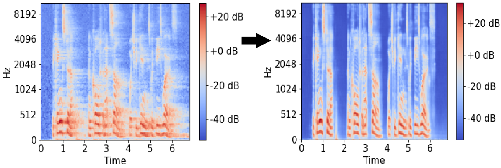

# Neural-Speech-Dereverberation
Machine and Deep Learning models for speech dereverberation

## Data
- LibriSpeech for speech audio files [1]. Available: https://www.openslr.org/12
- Omni and MARDY dataset for Room Impulse Responses (RIRs) [2, 3]. Available: http://isophonics.org/content/room-impulse-response-data-set
  and https://www.commsp.ee.ic.ac.uk/~sap/resources/mardy-multichannel-acoustic-reverberation-database-at-york-database/
- BUT Speech@FIT Reverb Database for retransmitted data [4]. Available: https://speech.fit.vutbr.cz/software/but-speech-fit-reverb-database

Data generated can be downloaded here: https://drive.google.com/drive/folders/1gYLP4G40HJxzzQrA_Gf2bnc18LUoB-4k?usp=sharing. It's only
simulated data, for retransmitted data follow BUT Speech@FIT instructions

## Models

- MLP 
- LSTM based model 
- FD-NDLP (WPE + frequency domain). 
  Implementation taken from https://github.com/helianvine/fdndlp
- U-net for speech dereverberation [6]. U-net architecture is based on image segmentation, available: https://github.com/milesial/Pytorch-UNet
- GAN training with U-net generator [6]

Download neural network weights here : https://drive.google.com/drive/folders/1wAls6GGppERIFUDEG12gk7zxNBU_iuff?usp=sharing 

Speech Enhancement Example with U-net generator:

## Metrics
- Perceptual Evaluation of Speech Quality (PESQ)
- Cepstral Distorsion (CD)
- Log Likelihood Ratio (LLR)
- Frequency-Weighted Segmental Signal to Noise Ratio (fwSNRseg)
- Speech to Reverberation Modulation Energy Ratio (SRMR)

Python implementation is taken from: https://github.com/schmiph2/pysepm

## References

[1] Vassil Panayotov, Guoguo Chen, Daniel Povey and Sanjeev Khudanpur, "LibriSpeech: an ASR corpus based on public domain audio books", ICASSP 2015.

[2] R. Stewart and M. Sandler, "Database of omnidirectional and B-format room impulse responses," 2010 IEEE International Conference on Acoustics, Speech and Signal Processing, Dallas, TX, USA, 2010, pp. 165-168, doi: 10.1109/ICASSP.2010.5496083.

[3] J. Y. C. Wen, N. D Gaubitch, E. a. P. Habets, T. Myatt, and P. a. Naylor, "Evaluation of Speech Dereverberation Algorithms using the MARDY Database," Proc. Intl. Workshop Acoust. Echo Noise Control  (IWAENC)}, pp. 12-15, 2006. 

[4] I. Szöke, M. Skácel, L. Mošner, J. Paliesek and J. Černocký, ''Building and evaluation of a real room impulse response dataset'', in IEEE Journal of Selected Topics in Signal Processing, vol. 13, no. 4, pp. 863-876, Aug. 2019, doi: 10.1109/JSTSP.2019.2917582.

[5] T. Nakatani, T. Yoshioka, K. Kinoshita, M. Miyoshi and B. Juang, "Speech Dereverberation Based on Variance-Normalized Delayed Linear Prediction," in IEEE Transactions on Audio, Speech, and Language Processing, vol. 18, no. 7, pp. 1717-1731, Sept. 2010, doi: 10.1109/TASL.2010.2052251.

[6] Ori Ernst, Shlomo E. Chazan, Sharon Gannot and Jacob Goldberger, "Speech Dereverberation Using Fully Convolutional Networks". Faculty of Engineering, Bar-Ilan University, 3 Apr, 2019.
